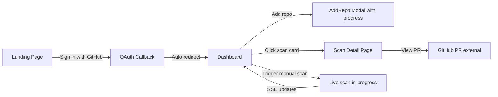

# Aegis Frontend Redesign — Premium Hackathon-Winning UI

## Project Understanding (Deep Analysis)

### What Aegis Does
Aegis is an **autonomous white-hat vulnerability remediation swarm** — a multi-agent AI system that monitors GitHub repos and, on every push:

1. **Scans** code with Semgrep (static analysis)
2. **Finds** vulnerabilities via AI (Agent 1 — Finder, uses Codestral)
3. **Exploits** them in a Docker sandbox (Agent 2 — Exploiter, uses Codestral)
4. **Patches** the code (Agent 3 — Engineer, uses Devstral 2)
5. **Verifies** the patch by re-running exploit + tests (Agent 4 — Verifier)
6. **Opens a GitHub PR** with proof-of-exploit and the fix

### Backend Architecture (FastAPI)
| Component | File | Role |
|---|---|---|
| Entry point | `main.py` | FastAPI app, CORS, webhook receiver, background pipeline |
| Pipeline | `orchestrator.py` | 8-phase pipeline, DB status updates, SSE broadcast |
| Agent 1 | `agents/finder.py` | Identifies ALL vulns from diff + semgrep + RAG |
| Agent 2 | `agents/exploiter.py` | Writes exploit script to prove vuln is real |
| Agent 3 | `agents/engineer.py` | Writes patched code + test code |
| Agent 4 | `agents/reviewer.py` | Remediation loop (up to 3 retries) |
| Scanner | `scanner/semgrep_runner.py` | Semgrep (local or Docker fallback) |
| RAG | `rag/indexer.py`, `rag/retriever.py` | ChromaDB-based codebase context |
| Sandbox | `sandbox/docker_runner.py` | Isolated Docker container for exploits/tests |
| GitHub | `github_integration/` | Webhook verify, diff fetch, PR creation |
| DB | `database/models.py` | Users, Repos, Scans (SQLite via SQLAlchemy) |
| API Routes | `routes/auth.py`, `routes/repos.py`, `routes/scans.py` | OAuth, repo CRUD, scan SSE + REST |

### Scan Status Lifecycle (10 states)
```
queued → scanning → exploiting → exploit_confirmed → patching → verifying → fixed
                  ↘ false_positive (exploit failed)
                  ↘ clean (no vulns found)
                  ↘ failed (pipeline error at any stage)
```

### Current Frontend (Next.js 16 + Tailwind 4 + shadcn)
| Page | Current State | Issues |
|---|---|---|
| Landing (`/`) | Feature cards + pipeline steps | Generic, no animation, feels template-y |
| Dashboard (`/dashboard`) | Repo list + scan feed | Flat layout, no visual hierarchy, no stats |
| Scan Detail (`/scans/[id]`) | Timeline + code blocks | Timeline is too cramped, no agent identity |
| Auth Callback (`/auth/callback`) | Simple spinner | Fine as-is |

---

## What Makes This "Extremely Complex Yet Simple to Use"

> [!IMPORTANT]
> The hackathon judges want **novel features, not generic CRUD**. The key insight: Aegis has **4 AI agents working in sequence**. The frontend must make this **visible and cinematic** — like watching a security operation unfold in real-time.

### Non-Generic Novel Features to Build

1. **Live Agent Activity Feed** — Real-time SSE-powered display showing each agent thinking/working with status, like a mission control center
2. **Animated Pipeline Visualization** — A horizontal pipeline that animates through stages with glowing transitions (not just colored dots)
3. **Exploit Terminal** — A terminal-style component that streams exploit output character-by-character (typewriter effect)
4. **Before/After Code Diff** — Side-by-side diff view showing vulnerable → patched code with syntax highlighting
5. **Threat Severity Heatmap** — Color-coded grid of repos showing security health at a glance
6. **Agent Avatars & Personas** — Each agent has a distinct identity (🔍 Finder, 🎯 Exploiter, 🔧 Engineer, ✅ Verifier) with avatar icons
7. **Scan Duration Timer** — Live elapsed time counter while scan is running
8. **One-Click Demo Trigger** — "Run Demo Scan" button that triggers a real scan on the test repo

---

## User Flow



### Key UX Principles
1. **Zero-config**: Sign in → paste repo URL → done. Monitoring starts.
2. **Passive monitoring**: Dashboard auto-updates via SSE. No manual refresh.
3. **Progressive disclosure**: Scan cards show summary → click for full terminal output, diff, PR.
4. **Visual storytelling**: Pipeline animation tells the story of "we found it, proved it, fixed it."

---

## Proposed Changes

### Design System Overhaul

#### [MODIFY] [globals.css](file:///Users/jivitrana/Desktop/Aegis/aegis-frontend/app/globals.css)

Complete rework of the design system:
- **Color palette**: Deep navy background (`oklch(0.11 0.01 260)`) instead of current near-black. Emerald green primary → cyan-green gradient for a "cyber" feel.
- **Accent colors**: Red for threats, amber for warnings, emerald for safe, cyan for active/scanning
- **New utility classes**:
  - `.aegis-terminal` — Monospace terminal-style container with scanlines effect
  - `.aegis-pipeline-node` — Glowing pipeline node with animated border
  - `.aegis-pulse-ring` — Concentric pulsing rings for active status
  - `.aegis-typewriter` — Character-by-character text reveal animation
  - `.aegis-gradient-border` — Animated gradient border effect for featured cards
  - `.aegis-scanline` — Subtle CRT scanline overlay for terminal blocks
- **Keyframes**: Pulse ring, typewriter cursor blink, gradient rotation, status glow

---

### Landing Page — Make It Cinematic

#### [MODIFY] [page.tsx](file:///Users/jivitrana/Desktop/Aegis/aegis-frontend/app/page.tsx)

**Current problems**: Generic SaaS template feel. No personality. Static.

**Redesign**:
1. **Hero section**: 
   - Large animated shield icon with pulsing gradient rings
   - Headline: "Your AI Security Team Never Sleeps" 
   - Sub-headline explaining the 4-agent swarm
   - CTA: Glowing "Connect GitHub" button with hover lift

2. **Agent Showcase** (replaces generic feature cards):
   - 4 cards, one per agent, with distinct avatars and color accents
   - Agent 1 (Finder) — 🔍 Cyan — "Scans every line of changed code"
   - Agent 2 (Exploiter) — 🎯 Red — "Writes real exploits to prove vulnerabilities"
   - Agent 3 (Engineer) — 🔧 Amber — "Generates secure patches automatically"
   - Agent 4 (Verifier) — ✅ Green — "Runs tests + re-exploits to confirm the fix"
   - Each card has a subtle hover animation revealing more detail

3. **Live Pipeline Demo** (replaces static "how it works"):
   - An animated horizontal pipeline that auto-plays through the 5 stages
   - Each stage lights up sequentially with a glowing connector
   - Shows sample data: "SQL Injection found in `app.py:12`" → "Exploit succeeded" → "Patch applied" → "PR opened"

4. **Stats bar** (new):
   - "N vulnerabilities found" / "N patches generated" / "N PRs opened"
   - These can be hardcoded initially or pulled from the DB

---

### Dashboard — Mission Control

#### [MODIFY] [dashboard/page.tsx](file:///Users/jivitrana/Desktop/Aegis/aegis-frontend/app/dashboard/page.tsx)

**Current problems**: Flat list layout. No visual hierarchy. No aggregated stats. No visual differentiation between repo cards and scan cards.

**Redesign into 3 zones**:

1. **Top Bar Stats** (new section):
   - 4 stat cards in a row:
     - Total Repos Monitored (with icon)
     - Active Scans (with pulsing dot if any)  
     - Vulnerabilities Fixed (lifetime count)
     - Last Scan Time (relative time)
   - Glassmorphism cards with subtle gradient borders

2. **Repos Section** (improved):
   - Cards show: repo name, status badge, last scan time, vulnerability count
   - Color-coded left border: green (monitoring/clean), amber (setting_up), red (error)
   - "Scan Now" button with loading state
   - Add Repo button with improved modal

3. **Live Scan Feed** (dramatically improved):
   - Replace flat card list with a **timeline-style feed**
   - Each scan entry shows:
     - Agent avatar for current stage
     - Animated status indicator (spinning for active, checkmark for done)
     - Elapsed time counter for in-progress scans
     - Vulnerability type + severity badge when found
     - Inline "View PR" button when fixed
   - Active scans appear at top with a glowing border and pulse animation
   - Completed scans below with muted styling

---

### Scan Detail — The Cinematic View

#### [MODIFY] [scans/[id]/page.tsx](file:///Users/jivitrana/Desktop/Aegis/aegis-frontend/app/scans/%5Bid%5D/page.tsx)

**Current problems**: Status timeline is cramped horizontal pills. Code blocks are plain `<pre>`. No sense of agent "working."

**Redesign**:

1. **Vertical Pipeline Timeline** (replaces horizontal):
   - Full-width vertical timeline with large icons
   - Each step shows: agent avatar, agent name, status, timestamp
   - Active step has animated glow ring and "Agent is working..." text
   - Completed steps show duration ("took 4.2s")
   - Failed steps show red with inline error
   - Connecting line animates (gradient fill) as pipeline progresses

2. **Exploit Terminal** (replaces plain code block):
   - Terminal-style dark container with title bar ("Exploit Output — Docker Sandbox")
   - Green/red monospace text
   - Typewriter animation on first load
   - "VULNERABLE: SQL Injection" highlighted in red
   - Copy button

3. **Code Diff View** (replaces plain patch display):
   - Side-by-side or unified diff view
   - Syntax highlighted
   - Red lines (removed/vulnerable) on left, green lines (patched) on right
   - Line numbers

4. **PR CTA Card** (improved):
   - Large, prominent card with gradient border
   - "Vulnerability Fixed! Review the PR" with GitHub icon
   - Shows PR number and title
   - Glowing button

---

### New Components

#### [NEW] `components/AgentAvatar.tsx`
Reusable avatar component for each agent with distinct icon, color, and label:
- Finder: `Search` icon, cyan
- Exploiter: `Crosshair` icon, red  
- Engineer: `Wrench` icon, amber
- Verifier: `ShieldCheck` icon, green

#### [NEW] `components/PipelineTimeline.tsx`
Vertical animated pipeline used on scan detail page. Features:
- Animated connecting line (SVG gradient)
- Glow effect on active node
- Agent avatar per step
- Duration display

#### [NEW] `components/ExploitTerminal.tsx`
Terminal-style output display:
- Dark background with subtle scanline effect
- Title bar with "minimize/maximize/close" dots (decorative)
- Typewriter text animation
- Syntax highlighting for key terms (VULNERABLE, NOT_VULNERABLE, ERROR)
- Copy to clipboard

#### [NEW] `components/CodeDiff.tsx`
Syntax-highlighted diff viewer:
- Line-by-line diff with +/- indicators
- Color coded (red = removed, green = added)
- Line numbers
- File name header

#### [NEW] `components/StatCard.tsx`
Glassmorphism stat card for dashboard:
- Icon, label, value
- Optional trend indicator
- Subtle gradient border

#### [NEW] `components/LiveTimer.tsx`
Elapsed time counter for active scans:
- Updates every second
- Shows "Xm Ys" format
- Pulses when active

---

### API Client Enhancement

#### [MODIFY] [lib/api.ts](file:///Users/jivitrana/Desktop/Aegis/aegis-frontend/lib/api.ts)

Add new helper methods:
- `triggerScan(repoId: number)` — Properly abstracted (currently hardcoded in dashboard)
- `getStats(userId: number)` — Aggregate stats (can be computed client-side from scans/repos)

---

### Backend: New Stats Endpoint

#### [MODIFY] [routes/scans.py](file:///Users/jivitrana/Desktop/Aegis/routes/scans.py)

Add a new endpoint:
```python
@router.get("/api/stats")
async def get_stats(user_id: int):
    """Aggregate stats for dashboard cards."""
    # Returns: total_repos, active_scans, vulns_fixed, total_scans
```

This gives the dashboard real numbers to display.

---

## Implementation Order

| Phase | Files | Description |
|-------|-------|-------------|
| 1 | `globals.css` | Design system: colors, keyframes, utility classes |
| 2 | `StatCard`, `AgentAvatar`, `LiveTimer` | New atomic components |
| 3 | `page.tsx` (landing) | Cinematic landing page with agent showcase |
| 4 | `ExploitTerminal`, `CodeDiff`, `PipelineTimeline` | Feature components |
| 5 | `dashboard/page.tsx` | Mission control dashboard redesign |
| 6 | `scans/[id]/page.tsx` | Cinematic scan detail with pipeline + terminal |
| 7 | `VulnCard.tsx` | Enhanced scan feed card |
| 8 | `api.ts`, `routes/scans.py` | Stats endpoint + API cleanup |
| 9 | Polish | Animations, responsive, edge cases |

---

## Verification Plan

### Automated Tests
- `npm run build` must pass with no errors
- All existing API contracts preserved (no backend breaking changes)

### Manual Verification
- Run `npm run dev` and navigate all pages
- Test SSE real-time updates by triggering a scan
- Verify responsive layout on mobile viewport
- Test dark mode contrast (WCAG AA)
- Verify OAuth flow still works end-to-end

### Browser Testing
- Use browser tool to capture screenshots of each page
- Verify animations render correctly
- Test scan detail page with various scan states (clean, fixed, failed, in-progress)

---

## Open Questions

> [!IMPORTANT]
> **Dependencies**: Should we add `framer-motion` for animations, or stick with CSS-only? Framer Motion would enable smoother pipeline animations and layout transitions, but adds ~30KB. CSS-only is lighter but more limited.

> [!IMPORTANT]  
> **Syntax Highlighting**: For the code diff view, should we use a library like `react-syntax-highlighter` or `shiki`, or keep it simple with pre-styled `<pre>` blocks? A library gives proper Python/JS highlighting but adds bundle size.

> [!NOTE]
> **Stats Endpoint**: The `/api/stats` endpoint is a minor backend addition. We can also compute stats purely client-side from existing data. Which do you prefer?

> [!NOTE]
> **Mobile Priority**: The hackathon demo will likely be on a laptop. Should we invest time in mobile responsiveness, or focus entirely on the desktop experience?
