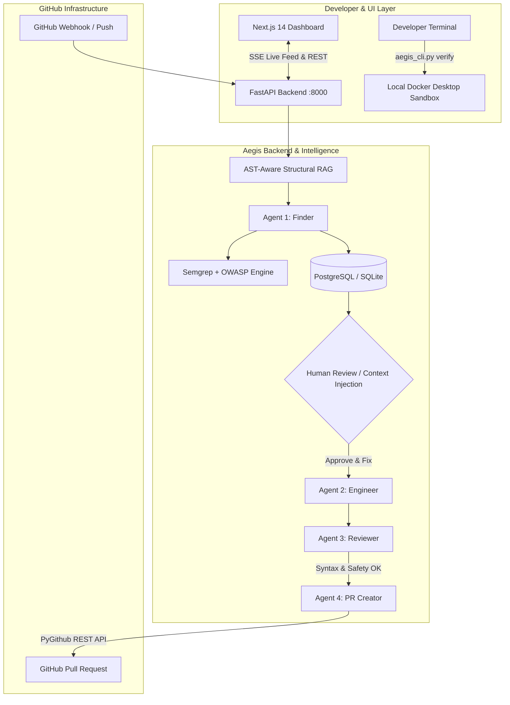

# 🛡️ Aegis 2.0 — Comprehensive Architecture & System Guide

Welcome to the **Aegis 2.0 In-Depth Architectural Guide**. This document breaks down the entire system design, multi-agent orchestration, data flows, and security isolation layers in plain English with technical rigor.

---

## 📑 Table of Contents
1. [The Core Philosophy](#1-the-core-philosophy)
2. [End-to-End System Diagram](#2-end-to-end-system-diagram)
3. [The 4-Agent Autonomous Pipeline](#3-the-4-agent-autonomous-pipeline)
4. [AST-Aware Structural Codebase RAG](#4-ast-aware-structural-codebase-rag)
5. [Interactive Issue Hub & Human-in-the-Loop](#5-interactive-issue-hub--human-in-the-loop)
6. [Zero-Trust Local Docker Sandbox CLI](#6-zero-trust-local-docker-sandbox-cli)
7. [Database & State Persistence](#7-database--state-persistence)
8. [GitHub App Authentication & Permissions](#8-github-app-authentication--permissions)

---

## 1. The Core Philosophy

Traditional static application security testing (SAST) tools generate hundreds of raw warnings. Most engineering teams ignore them because 80%+ are false positives, and the tools stop at alerting rather than fixing.

**Aegis solves this by answering three fundamental questions for every line of code:**
1. **Is the vulnerability real?** (Verified via AST structural context + LLM reasoning).
2. **Can it be safely proven?** (Reproduced locally via zero-trust Docker Desktop container isolation).
3. **Can we fix it without human friction?** (Synthesized surgical patch + companion regression test + automated GitHub Pull Request).

---

## 2. End-to-End System Diagram



---

## 3. The 4-Agent Autonomous Pipeline

Aegis uses a deterministic, sequential multi-agent state machine where each agent has one strict responsibility and output contract:

```
[Target Repo] ➔ 🔍 Finder Agent ➔ 📋 Interactive Issue ➔ 🛠️ Engineer Agent ➔ 🛡️ Reviewer Agent ➔ 🚀 PR Creator
```

### 🔍 1. Finder Agent (`backend/app/agents/finder.py`)
- **Input:** Target repository files + AST structural map + Semgrep rule outputs.
- **Role:** Triages raw static warnings, cross-references imports, callers, and route decorators to determine exploitability. Assigns strict **CVSS v3.1** severity (`CRITICAL`, `HIGH`, `MEDIUM`, `LOW`).
- **Output:** Structured `List[FindingInfo]` containing exact file paths, line numbers, and technical explanation.

### 🛠️ 2. Engineer Agent (`backend/app/agents/engineer.py`)
- **Input:** Vulnerable file content + Finding diagnosis + Developer context injection.
- **Role:** Generates a minimal surgical fix (e.g. parameterizing raw SQL string interpolation, adding regex input validation, or swapping `os.system` for secure subprocess lists).
- **Output:** Patched file content + Unified Git Diff + Pytest regression test case.

### 🛡️ 3. Reviewer Agent (`backend/app/agents/reviewer.py`)
- **Input:** Original code vs. Patched code.
- **Role:** Validates Python AST syntax to ensure zero compile-time syntax errors, checks for unintended side-effects, and confirms the vulnerability is neutralized.
- **Output:** `{"is_safe": true, "feedback": "..."}` boolean safety verdict.

### 🚀 4. PR Creator Agent (`backend/app/agents/pr_creator.py`)
- **Input:** Verified patch + PR summary markdown.
- **Role:** Creates a dedicated security fix branch (e.g. `aegis/fix-sql-injection-17869...`), commits the patch, and opens a GitHub Pull Request with clear diagnosis and regression test proof.

---

## 4. AST-Aware Structural Codebase RAG

Instead of loading heavy, memory-intensive embedding models (which cause Out-Of-Memory crashes on cloud tiers), Aegis uses an **AST-Aware Structural Codebase Indexer** (`backend/app/rag/tree_indexer.py`):

1. **Hierarchy Builder:** Generates an ASCII tree of all directories and source files (skipping `.git`, `node_modules`, `venv`, binary assets).
2. **Symbol Extractor:** Parses Python files with `ast.parse` to extract:
   - Function signatures & parameters.
   - Class declarations & inheritance.
   - Route decorators (e.g. `@app.get("/users")`, `@router.post("/auth")`).
   - Module imports and database connections.
3. **Speed & Efficiency:** Indexes a 50,000-line repository in **< 50ms**, producing a rich ~15KB context block that fits comfortably inside Groq LLM context windows.

---

## 5. Interactive Issue Hub & Human-in-the-Loop

Aegis pauses at the `awaiting_approval` state when vulnerabilities are found, giving developers full visibility and control:

- **Review Findings:** The web dashboard displays the exact vulnerable lines, severity badges, and CVSS vector.
- **Context Injection:** Developers can provide custom instructions before the patch is generated (e.g., *"Use SQLAlchemy session.query instead of raw SQL"* or *"Validate input with pydantic"*).
- **One-Click Action:** Clicking **"Approve & Fix"** resumes the pipeline, synthesizes the patch, and opens the PR.

---

## 6. Zero-Trust Local Docker Sandbox CLI

To showcase real DevOps container security without fighting cloud container constraints, Aegis provides a standalone local CLI runner (`backend/runner/aegis_cli.py`):

```bash
# Verify scan finding inside isolated container
python backend/runner/aegis_cli.py verify <scan_id>
```

### Container Hardening Specifications:
- **`--network none`:** Completely disables container networking. The exploit cannot touch external APIs or exfiltrate secrets.
- **`--cap-drop ALL`:** Strips all Linux root capabilities.
- **`--memory 512m` & `--cpus 1.0`:** Strict CPU and RAM quotas prevent Denial of Service.
- **`--user 10001:10001` (`sandboxuser`):** Enforces unprivileged non-root execution.
- **`-v /path:/app:ro`:** Codebase is mounted strictly **Read-Only**.

---

## 7. Database & State Persistence

Aegis uses SQLAlchemy 2.0 with automatic dual-engine fallback:
- **Production:** PostgreSQL (Supabase / AWS RDS).
- **Local Dev / Offline:** SQLite (`sqlite:///./aegis.db`) with zero manual setup needed.

### Core Tables:
- `users`: GitHub OAuth profiles & GitHub App Installation IDs.
- `repositories`: Monitored repositories and webhook subscriptions.
- `scans`: Full lifecycle records (commit SHA, branch, status, findings JSON, patch diff, PR URL).
- `issues`: Interactive findings with CLI reproduction commands and developer notes.

---

## 8. GitHub App Authentication & Permissions

Aegis authenticates using standard GitHub App RS256 JWTs (`backend/app/github/auth.py`):
1. Signs an App JWT using `GITHUB_APP_ID` and `GITHUB_APP_PRIVATE_KEY` (valid for 10 minutes).
2. Exchanges JWT for a temporary **Installation Access Token** (valid for 1 hour, cached in-memory).
3. Completely avoids static Personal Access Tokens (PATs) for zero-credential leakage.
