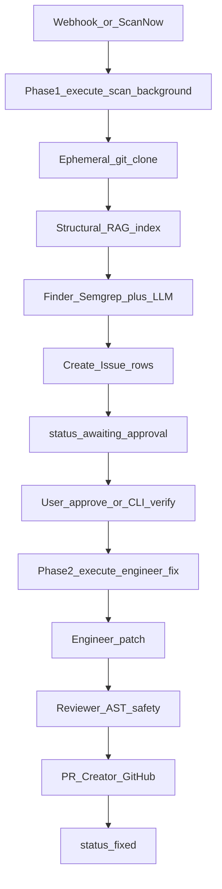

# Aegis — Project Memory (Canonical)

> **Purpose:** Persistent brain for any AI/model working in this repo. Survives chat resets and model switches.  
> **Update when:** Stage changes, deploy URLs change, or major architecture drifts.  
> **Secrets:** List **env var names only**. Never paste key values here.

**Last updated:** 2026-09-03 (ship-candidate)

---

## 0. Agent stack (Karpathy + Ralph + Aegis memory)

Model-agnostic customization lives in-repo so Grok → Composer (or any model) keeps the same behavior:

| Component | Path | Role |
|-----------|------|------|
| Project brain | `docs/PROJECT_MEMORY.md` | Stage, paths, deploy names |
| Aegis rules | `.cursor/rules/aegis-*.mdc` | Product security + layout |
| Karpathy 4 | `.cursor/rules/karpathy-guidelines.mdc` | Think / simple / surgical / verify |
| Discipline 10 | `.cursor/rules/engineering-discipline.mdc` | Expanded self-verify rules |
| Ralph task | `RALPH_TASK.md` | Checkbox success criteria |
| Ralph state | `.ralph/progress.md`, `guardrails.md` | Loop memory across context resets |
| Ralph CLI | `./scripts/ralph`, `.cursor/ralph-scripts/` | Overnight `cursor-agent` loops |
| Ralph IDE | `.cursor/agents/ralph-loop.md`, `.cursor/skills/ralph-loop/` | `/ralph-loop` + skill |
| Entrypoint | `AGENTS.md` | What to read first |

**How to loop:** complete next `[ ]` in `RALPH_TASK.md` → verify → update `.ralph/progress.md` → rotate context when polluted. CLI: `RALPH_MODEL=composer-2 ./scripts/ralph loop -n 20 -y` (install `cursor-agent` first).

---

## 1. Product one-liner

Aegis 2.0 is an autonomous security remediation platform: it monitors GitHub repos, finds real vulns (Semgrep + LLM Finder), pauses for human/local verify, then generates a patch (Engineer), safety-checks it (Reviewer), and opens a GitHub PR.

---

## 2. Stage snapshot (2026-09-03)

**Stage:** **Ship-candidate** — production hardening complete; Ralph loop verified locally. All `RALPH_TASK.md` criteria green.

| Area | Status |
|------|--------|
| Core pipeline (scan → findings → approve → patch → PR) | Built + e2e verified |
| Frontend (Next.js 14 dashboard) | Built; `npm run build` passes |
| Local Docker Compose | Present |
| Cloud deploy (Render backend + Vercel frontend) | Live; `GET /health` → 200 on Render |
| Blackbox / adversarial tests | **Committed** (`backend/tests/blackbox/`, `pipeline-test-*.sh`) |
| Antigravity/agent plugin | Present (`.agents/plugins/aegis-dev/`) |
| Cursor memory rules | Present (`.cursor/rules/`, this file, `AGENTS.md`) |
| Karpathy + engineering-discipline | Present (always-on rules) |
| Ralph Wiggum loop | Present + verified (task, `.ralph/`, scripts); CLI needs `cursor-agent` |

**Git:**
- Active branch: `main` (tracks `origin/main`)
- Ship-hardening commit pending push (Ralph iteration 2026-09-03)

**Production hardening landed (2026-09-03):**
- Fail-closed auth (no auto-user fallback)
- Strict webhook HMAC (no missing-signature bypass)
- 1MB payload limit middleware
- Shared LLM JSON extraction utility
- Blackbox + adversarial test suites

**Doc drift warning:** Prefer this file over older docs that mention root `main.py`, `github_integration/`, or ChromaDB as primary RAG. Live layout is under `backend/app/` with structural RAG in `backend/app/rag/`.

---

## 3. As-built architecture (real paths)

```
Aegis/
├── backend/app/
│   ├── main.py              # FastAPI entry
│   ├── config.py            # Pydantic Settings — ONLY place to read env
│   ├── api/                 # auth, repos, scans, stats, webhooks
│   ├── agents/              # finder, engineer, reviewer, pr_creator
│   ├── pipeline/orchestrator.py  # Phase 1 scan + Phase 2 fix
│   ├── rag/                 # tree_indexer, context_builder
│   ├── scanner/semgrep.py
│   ├── github/              # auth.py (App JWT), client.py
│   ├── models/entities.py   # User, Repository, Scan, Issue
│   ├── schemas/
│   └── core/                # database, llm_client, security, utils
├── backend/runner/          # aegis_cli.py + Dockerfile.sandbox
├── backend/tests/           # test_e2e_pipeline.py + blackbox/
├── aegis-frontend/          # Next.js 14 App Router
├── Dockerfile               # Render production backend
├── docker-compose.yml       # local: backend, frontend, postgres, redis, sandbox
└── docs/                    # PRD, playbooks, THIS memory file
```

**Stack:** FastAPI + SQLAlchemy 2.0 (Postgres preferred, SQLite fallback) + Groq LLM + Semgrep + Docker sandbox + Next.js 14.  
**Deploy:** Backend → Render; Frontend → Vercel; DB → Supabase Postgres (when configured).

### Pipeline (as implemented)



Human-in-the-loop pause is intentional: Phase 1 ends at `awaiting_approval`; Phase 2 runs after approve (optional user context).

### Agent output contracts

- **Finder** → findings with severity, file, lines, description/code (`VulnerabilityFinding`-style)
- **Engineer** → patched content + explanation + patch diff (+ regression test expectation in conventions)
- **Reviewer** → safety / AST check (`is_safe`-style)
- **PR Creator** → branch + commit + PR URL via GitHub App installation token

Contract changes must update backend + frontend TypeScript in the same change set.

---

## 4. Key APIs & frontend surfaces

**Backend routers** (mounted at `/api/v1` in `backend/app/main.py`):
- `auth` — OAuth / session / me / warmup
- `repos` — link repos, list
- `scans` — trigger, approve/reject, detail, SSE live
- `stats` — dashboard metrics
- `webhooks` — GitHub events (also mounted at `/`)

**Frontend routes:**
- `/` landing, `/dashboard`, `/scans/[id]`, `/analytics`, `/auth/callback`
- API client: `aegis-frontend/lib/api.ts` (uses `NEXT_PUBLIC_API_URL` / `NEXT_PUBLIC_BACKEND_URL`)

**Known live URLs (names only; may rotate):**
- Frontend examples in CORS: `aegis-ecru-eta.vercel.app`, `aegis-frontend-zeta.vercel.app`
- Backend default in frontend client: `aegis-wpeu.onrender.com`

---

## 5. Deploy map & env var names (no values)

### Backend (Render)

| Name | Role |
|------|------|
| `DATABASE_URL` | Postgres (Supabase); SQLite fallback locally |
| `REDIS_URL` | Queue/cache when used |
| `GROQ_API_KEY` / `GROQ_API_KEYS` | LLM |
| `GROQ_MODEL` / `GROQ_ENGINEER_MODEL` | Model selection |
| `GEMINI_API_KEY` | Optional alternate |
| `GITHUB_APP_ID` | GitHub App |
| `GITHUB_APP_PRIVATE_KEY` | App PEM |
| `GITHUB_CLIENT_ID` / `GITHUB_CLIENT_SECRET` | OAuth |
| `GITHUB_WEBHOOK_SECRET` | Webhook HMAC |
| `FRONTEND_URL` / `API_BASE_URL` | CORS + redirects |
| `SESSION_SECRET` | Sessions |
| `CLI_API_KEY` | Local sandbox CLI auth |
| `RENDER` | Production guard flag |
| `PORT` | Injected by Render |
| `SEMGREP_TIMEOUT` | Scanner timeout |

Root `Dockerfile` runs: `uvicorn backend.app.main:app --host 0.0.0.0 --port $PORT` with `PYTHONPATH=/app`.

### Frontend (Vercel)

| Name | Role |
|------|------|
| `NEXT_PUBLIC_API_URL` | Backend base URL |
| `NEXT_PUBLIC_BACKEND_URL` | Alternate backend base |

Root directory for Vercel: `aegis-frontend`.

### Local `.env`

- File is gitignored (`.env`, `.env.production`, `*.env`).
- Agents may **read** local `.env` to debug when the user asks; never copy values into docs, commits, PRs, or logs.
- Prefer `backend/app/config.py` (`settings`) over `os.getenv` in feature code.

---

## 6. Local run commands

```bash
# Full stack helpers
./run-all.sh
./run-backend.sh
./run-frontend.sh

# Manual
.venv/bin/uvicorn backend.app.main:app --reload --port 8000
cd aegis-frontend && npm run dev

# Docker Compose
docker compose up -d

# Tests
./test-pipeline.sh
.venv/bin/python -m pytest backend/tests/
# Blackbox (when present):
./pipeline-test-api.sh
./pipeline-test-webhooks.sh
./pipeline-test-sandbox.sh
./pipeline-test-adversarial.sh

# Local sandbox verify
./verify-docker.sh <scan_id>
# or: python backend/runner/aegis_cli.py verify <id> --api-url http://localhost:8000
```

- Web: http://localhost:3000  
- API docs: http://localhost:8000/docs  

---

## 7. Security non-negotiables

- Sandbox (`backend/runner/Dockerfile.sandbox`): `cap_drop ALL`, `network: none`, non-root, read-only mounts, tight resource limits. Do not relax to “make tests pass.”
- Verify GitHub webhook signatures; never bypass for convenience.
- Reject scanning/fixing PRs from forks.
- Engineer patches should ship with regression test coverage per conventions.
- Fail closed when unsure (especially auth, webhooks, sandbox).

Also see: `.agents/plugins/aegis-dev/rules/aegis-conventions.md`

---

## 8. Known fragile points

- Render free/starter: cold starts; auth warmup/ping workarounds exist.
- Memory pressure on scans (~GB-scale risk with RAG); Semgrep wheel previously caused OOM — watch deps.
- Cross-site cookies Vercel↔Render: frontend uses Bearer / `X-Aegis-User-Id` fallbacks from localStorage.
- Single-node execution; no distributed scan workers in current as-built Phase 1/2 orchestrator.
- Large repos (>~100k LOC) unverified.

---

## 9. Do / Don’t for shipping agents

**Do**
- Read this file at session start for stage + paths.
- Keep changes minimal and path-correct (`backend.app.*` imports).
- Update this Stage snapshot when merging WIP or changing deploy URLs.
- Use existing scripts for e2e/blackbox before claiming ship-ready.

**Don’t**
- Commit secrets or write secret values into memory/rules.
- Trust stale `ARCHITECTURE_CONTEXT.md` / old root-layout docs over this file.
- Relax sandbox or webhook verification.
- Broad-refactor while shipping — fix the blocker in front of you.

---

## 10. Next ship checklist

Canonical checkboxes: **[`RALPH_TASK.md`](../RALPH_TASK.md)** (Ralph drives these). Summary:

1. Triage uncommitted WIP (commit or defer in `.ralph/progress.md`).
2. E2E + blackbox suites green locally.
3. Confirm Render env + health; Vercel `NEXT_PUBLIC_API_URL` matches backend.
4. Smoke: OAuth → link repo → scan → approve → PR.
5. Webhook signature path with fixture (no bypass).
6. Update this Stage snapshot to ship-candidate / shipped.

---

## 11. Related docs (secondary)

| Doc | Use |
|-----|-----|
| `docs/tasks/PRD.md` | Original task breakdown |
| `docs/DEVELOPER_PLAYBOOK.md` | Day-to-day commands |
| `docs/ARCHITECTURE_GUIDE.md` / `docs/AGENT_WORKFLOW.md` | Deeper narrative |
| `ARCHITECTURE_CONTEXT.md` | Older; verify paths before trusting |
| `CLAUDE.md` / `GEMINI.md` / `AGENTS.md` | Tool-specific entrypoints |
| `.agents/plugins/aegis-dev/` | Antigravity subagents (uncommitted at snapshot) |
