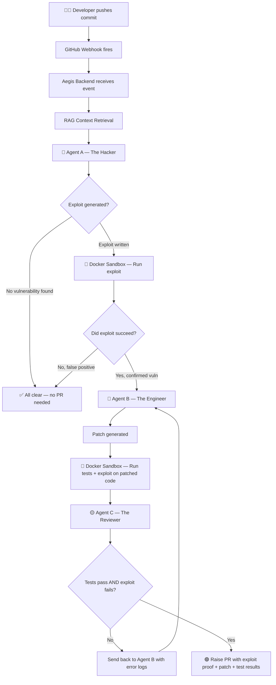
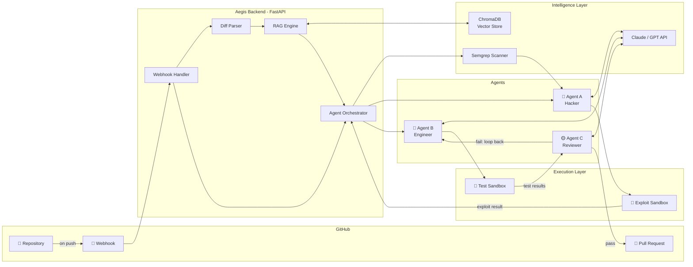
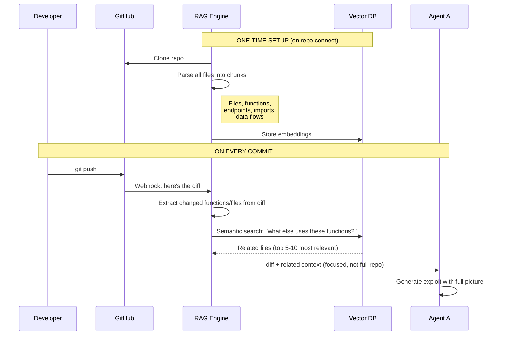
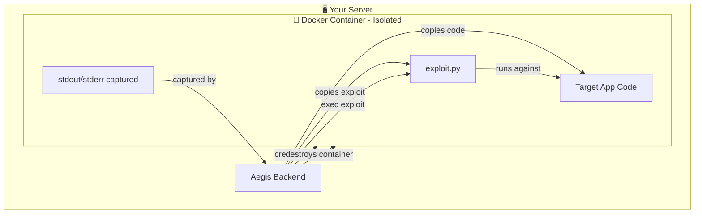
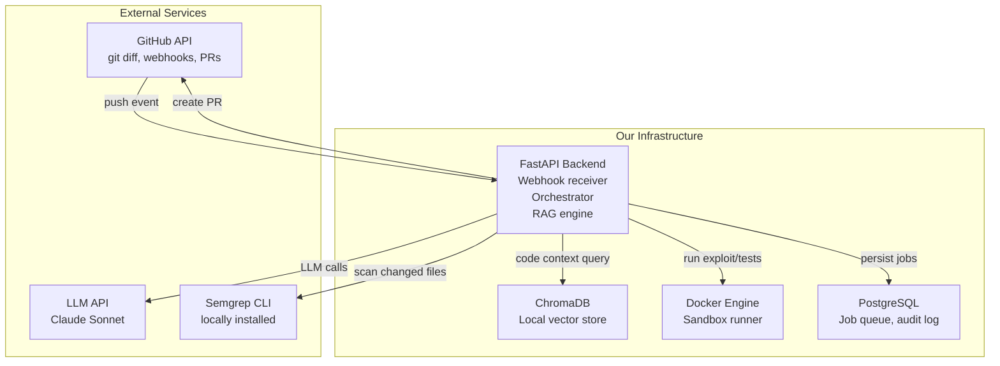
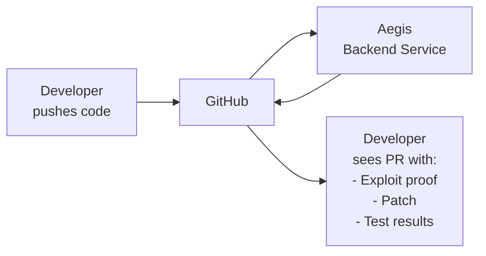

# 🛡️ Aegis — Autonomous White-Hat Vulnerability Remediation System

> **Hackathon Track:** The Autonomous "White-Hat" Vulnerability Remediation Swarm  
> **Problem:** Static analysis tools flag vulnerabilities — but they can't prove they exist, fix them, or verify the fix works.  
> **Solution:** A multi-agent system that hacks, patches, and validates your code — automatically, on every commit.

---

## 📌 Table of Contents

1. [The Real Problem We're Solving](#1-the-real-problem-were-solving)
2. [Industry Gap Analysis](#2-industry-gap-analysis)
3. [How Our System Works — High Level](#3-how-our-system-works--high-level)
4. [Architecture Deep Dive](#4-architecture-deep-dive)
5. [The RAG + Diff Strategy (Your Core Insight)](#5-the-rag--diff-strategy-your-core-insight)
6. [Why Docker — And How We Use It](#6-why-docker--and-how-we-use-it)
7. [Agent Design](#7-agent-design)
8. [Service Integration Map](#8-service-integration-map)
9. [What We Are As a Product](#9-what-we-are-as-a-product)
10. [MVP Scope](#10-mvp-scope)
11. [Competitor Analysis](#11-competitor-analysis)
12. [What Can Go Wrong (Fallbacks)](#12-what-can-go-wrong-fallbacks)
13. [Tech Stack](#13-tech-stack)

---

## 1. The Real Problem We're Solving

A developer pushes code. Here's what currently happens:

```
Developer pushes commit
        ↓
Snyk / SonarQube / Semgrep scans it
        ↓
"You have a SQL Injection in line 42"
        ↓
Developer reads the warning
        ↓
Developer manually figures out if it's actually exploitable
        ↓
Developer manually writes a fix
        ↓
Developer manually tests the fix
        ↓
Code review
        ↓
Merge
```

**The problem isn't detection. It's the 5 manual steps after detection.**

Average time to fix a vulnerability after detection: **~60 days** (industry stat).  
Percentage of flagged vulnerabilities that are false positives: **~40–70%** (depending on tool).

So developers have alert fatigue. They ignore warnings. Real vulnerabilities stay in production.

**We are automating those 5 manual steps.**

---

## 2. Industry Gap Analysis

| What Exists Today | What's Missing |
|---|---|
| Snyk — finds known CVEs in dependencies | Cannot prove if a custom vulnerability is exploitable |
| SonarQube — static code analysis | No automated exploit generation or patch suggestion |
| GitHub Dependabot — updates deps | Only handles dependency version bumps, not logic bugs |
| CodeQL — semantic code analysis | Requires manual query writing; no auto-remediation |
| Semgrep — pattern-based scanning | Flags patterns, doesn't validate exploitability |
| Copilot / Cursor — code suggestions | Reactive (you ask it); not proactively triggered by commits |

**The gap:** No tool today closes the loop from `detected → proved → patched → verified → merged`.

We close that loop. Fully autonomously.

---

## 3. How Our System Works — High Level



---

## 4. Architecture Deep Dive



---

## 5. The RAG + Diff Strategy (Your Core Insight)

This is the most important technical decision in the project. Let's be precise about what we're building.

### ❌ Wrong approach: Full RAG on every commit
Embedding the entire repo every time a commit happens is:
- **Slow** (embedding 10,000 files takes minutes)
- **Expensive** (API costs scale with repo size)
- **Noisy** (LLM gets confused by irrelevant context)

### ❌ Also wrong: Only the diff
A diff tells you *what changed*, but not *why it matters*. A 3-line change to an auth function could open a vulnerability across 40 other endpoints. Without knowing those 40 endpoints exist, Agent A is blind.

### ✅ The right approach: One-time index + diff-triggered smart retrieval



### What the RAG index stores

For each file in the repo, we embed and store:

```json
{
  "file": "src/auth/login.py",
  "functions": ["authenticate_user", "validate_token", "refresh_session"],
  "endpoints": ["POST /api/login", "GET /api/refresh"],
  "imports": ["db", "jwt", "bcrypt"],
  "summary": "Handles user authentication and JWT token management",
  "embedding": [0.23, 0.87, ...]
}
```

When a diff touches `authenticate_user`, we retrieve:
- All files that import `authenticate_user`
- All endpoints that call it
- Related middleware
- The test file for that module

**Agent A now has the full picture with minimal noise.**

---

## 6. Why Docker — And How We Use It

### The Core Problem

Agent A writes Python exploit scripts. Those scripts run real code. Without isolation:

```
exploit.py runs on your server
    → Can read /etc/passwd
    → Can make outbound HTTP calls
    → Can delete files
    → Can access your database
    → Can pivot to other services
```

This is catastrophic. You're literally running hacker code on your own infrastructure.

### Docker solves this completely



### Exactly how Docker is used, step by step

```python
# Step 1: Create fresh sandbox from our base image
container = docker.run(
    image="vulnswarm-sandbox:latest",
    detach=True,
    network_mode="none",        # No internet access
    mem_limit="256m",           # No memory abuse
    cpu_quota=50000,            # Limited CPU
    read_only=False,            # App needs to write (for testing)
    tmpfs={"/tmp": "size=64m"}  # Temp space only
)

# Step 2: Copy the target app code into the container
docker.copy(src="./repo_snapshot/", dst=f"{container.id}:/app")

# Step 3: Copy Agent A's exploit script
docker.copy(src="./exploit.py", dst=f"{container.id}:/exploit.py")

# Step 4: Run the exploit
result = docker.exec(container.id, "python /exploit.py", timeout=30)

# Step 5: Parse result
output = {
    "exit_code": result.exit_code,
    "stdout": result.stdout,
    "stderr": result.stderr,
    "exploit_succeeded": result.exit_code == 0 and "VULNERABLE" in result.stdout
}

# Step 6: Destroy container - nothing persists
docker.remove(container.id, force=True)
```

**Every single exploit run gets a brand-new, empty, isolated container. Nothing leaks. Nothing persists.**

---

## 7. Agent Design

### 🔴 Agent A — The Hacker

**Input:**
- Git diff (the changed code)
- Smart context from RAG (related files, functions, data flows)
- Semgrep output (vulnerability pattern matches)

**Task:**  
Write a self-contained Python exploit script that:
- Sets up the vulnerable condition
- Triggers the vulnerability
- Prints `VULNERABLE` to stdout if it succeeds
- Returns exit code 0 on success, 1 on failure

**Prompt structure:**
```
You are a security researcher.
Here is a code diff: [DIFF]
Here is the broader context of how this code is used: [RAG_CONTEXT]
Semgrep flagged this pattern: [SEMGREP_OUTPUT]

Write a Python exploit script that proves this vulnerability is exploitable.
The script must:
- Be self-contained (install any deps it needs)
- Print "VULNERABLE: <description>" if the exploit works
- Print "NOT_VULNERABLE" if it does not
- Return exit code 0 if vulnerable, 1 if not
```

---

### 🔵 Agent B — The Engineer

**Input:**
- The vulnerable code
- The exploit script
- The exploit output (proof of what went wrong)
- Existing unit tests

**Task:**  
Rewrite ONLY the vulnerable function(s) to fix the vulnerability without breaking existing functionality.

**Key constraint:** Agent B must NOT change the function signature or behavior for valid inputs — only reject/sanitize invalid inputs.

---

### 🟡 Agent C — The Reviewer

**Input:**
- Original code
- Patched code
- Exploit script
- Test run results

**Task:**  
Validate that:
1. All existing unit tests pass on the patched code ✅
2. The exploit script now returns `NOT_VULNERABLE` ✅
3. The patch makes semantic sense (no obvious backdoors or regressions) ✅

If any check fails → send full error log back to Agent B with specific instructions on what failed.

**Max retry loop:** 3 iterations. If Agent B cannot fix it in 3 tries, flag for human review.

---

## 8. Service Integration Map



### What each service does for us

| Service | Why We Need It | Cost |
|---|---|---|
| **GitHub Webhooks** | Trigger on every push, read diffs, create PRs | Free |
| **Semgrep CLI** | First-pass pattern scanning before we burn LLM tokens | Free (OSS) |
| **Claude/GPT API** | Exploit generation, patch writing, review logic | ~$0.01–0.10 per scan |
| **ChromaDB** | Local vector store for RAG — no external dependency | Free (local) |
| **Docker** | Isolated exploit + test execution | Free (local) |
| **FastAPI** | Backend server that wires everything together | Free (OSS) |
| **PostgreSQL** | Job tracking, retry logic, audit trail | Free (OSS) |

---

## 9. What We Are As a Product

**We are a GitHub App / backend service — NOT an IDE plugin (for now).**



### The developer experience

1. Developer connects their GitHub repo to Aegis (one-time OAuth)
2. Developer pushes code — **does nothing special**
3. Aegis runs silently in background
4. If a vulnerability is found and patched:
   - A PR appears automatically
   - The PR description includes the exploit output (proof it was real)
   - The PR includes the patch
   - The PR includes test results proving the fix works
5. Developer reviews and merges (or rejects)

**The developer's job is reduced to: review and merge.**

### Future expansion (not in MVP)

- VS Code extension — see vuln analysis inline while coding
- Slack bot — notifications when critical vulns are found
- Dashboard — security posture over time
- CLI tool — run on-demand before pushing

---

## 10. MVP Scope

### What we build at the hackathon

```mermaid
gantt
    title MVP Build Plan
    dateFormat HH
    axisFormat %H:%M

    section Phase 1 - Foundation
    GitHub webhook receiver       :00, 1h
    Diff parser                   :01, 30m
    Semgrep integration           :01, 1h

    section Phase 2 - RAG
    Repo indexer (embeddings)     :02, 1h
    ChromaDB setup                :03, 30m
    Context retrieval logic       :03, 1h

    section Phase 3 - Agents
    Agent A (Hacker)              :04, 1h
    Docker sandbox runner         :05, 1h
    Agent B (Engineer)            :06, 1h
    Agent C (Reviewer)            :07, 1h

    section Phase 4 - Output
    GitHub PR creation            :08, 1h
    End-to-end test               :09, 1h
    Demo prep                     :10, 1h
```



### MVP feature list

| Feature | In MVP? | Notes |
|---|---|---|
| GitHub webhook listener | ✅ | Core trigger |
| Diff parsing | ✅ | What changed |
| Semgrep scan on diff | ✅ | First-pass filter (cheap) |
| RAG index on repo setup | ✅ | One-time on connect |
| Smart context retrieval | ✅ | Key differentiator |
| Agent A — exploit generation | ✅ | Core |
| Docker sandbox execution | ✅ | Safety critical |
| Agent B — patch generation | ✅ | Core |
| Agent C — verification loop | ✅ | Core |
| GitHub PR creation | ✅ | Output |
| Multi-language support | ❌ | Python only for MVP |
| Dashboard/UI | ❌ | Post-hackathon |
| Slack notifications | ❌ | Post-hackathon |
| VS Code extension | ❌ | Post-hackathon |

### Mock repo for demo

For the hackathon demo, use a repo with intentionally vulnerable code:

```python
# BEFORE (vulnerable) — SQL Injection
def get_user(username):
    query = f"SELECT * FROM users WHERE username = '{username}'"
    return db.execute(query)

# Agent A writes this exploit:
# username = "' OR '1'='1"
# → dumps entire users table

# Agent B patches to:
def get_user(username):
    query = "SELECT * FROM users WHERE username = ?"
    return db.execute(query, (username,))
```

---

## 11. Competitor Analysis

| Product | Detect | Prove Exploitable | Auto-Patch | Auto-Verify | Raises PR |
|---|---|---|---|---|---|
| **Snyk** | ✅ | ❌ | ❌ (suggestions only) | ❌ | ❌ |
| **SonarQube** | ✅ | ❌ | ❌ | ❌ | ❌ |
| **GitHub Dependabot** | ✅ (deps only) | ❌ | ✅ (version bumps only) | ✅ (basic) | ✅ |
| **CodeQL** | ✅ | ❌ | ❌ | ❌ | ❌ |
| **Semgrep** | ✅ | ❌ | ❌ | ❌ | ❌ |
| **Cursor / Copilot** | ❌ (reactive) | ❌ | Suggestions | ❌ | ❌ |
| **Aegis** | ✅ | ✅ | ✅ | ✅ | ✅ |

**We are the only system that closes the full loop.**

---

## 12. What Can Go Wrong (Fallbacks)

| Risk | Likelihood | Mitigation |
|---|---|---|
| Agent A generates a bad exploit that crashes the sandbox | Medium | Docker timeout (30s), container destroyed after run |
| Agent B's patch breaks functionality | Medium | Agent C re-runs tests; loop up to 3 times |
| Agent B can't fix after 3 tries | Low | PR flagged as "needs human review"; still raised with exploit proof |
| LLM hallucinates a vulnerability | Medium | Semgrep pre-filter reduces false positives before LLM call |
| RAG retrieves irrelevant context | Low | Similarity threshold filter; top-5 results only |
| Docker escape (container breakout) | Very Low | Use rootless Docker + seccomp profiles |
| GitHub API rate limits | Low | Queue system with exponential backoff |
| Exploit leaks sensitive data from sandbox | Very Low | No real DB in sandbox; mock data only |

---

## 13. Tech Stack

```
Backend:        Python + FastAPI
Agent LLM:      Claude Sonnet (claude-sonnet-4-20250514)
Static Scanner: Semgrep (OSS)
RAG:            LangChain + ChromaDB + OpenAI text-embedding-3-small
Sandbox:        Docker (rootless) + Python:3.11-slim base image
Queue:          PostgreSQL + pgqueue (simple, no Redis needed for MVP)
GitHub:         PyGithub library + GitHub Apps OAuth
Tests:          pytest (run inside Docker sandbox)
Deployment:     Single VPS or Railway.app for hackathon
```

### Key files structure

```
vulnswarm/
├── main.py                  # FastAPI app, webhook endpoint
├── orchestrator.py          # Agent coordination logic
├── rag/
│   ├── indexer.py           # Initial repo scan + embedding
│   └── retriever.py         # Context retrieval on commit
├── agents/
│   ├── hacker.py            # Agent A
│   ├── engineer.py          # Agent B
│   └── reviewer.py          # Agent C
├── sandbox/
│   ├── docker_runner.py     # Container lifecycle management
│   └── Dockerfile           # Sandbox image definition
├── github/
│   ├── webhook.py           # Webhook receiver + validation
│   └── pr_creator.py        # PR generation
└── scanner/
    └── semgrep_runner.py    # First-pass static analysis
```

---

## 🎯 The One-Line Pitch

> **Aegis automatically hacks your code to prove a vulnerability is real, then patches it, then verifies the fix — and raises a PR. No developer action needed.**

---

*Built for the Autonomous White-Hat Vulnerability Remediation Swarm Hackathon Track*
