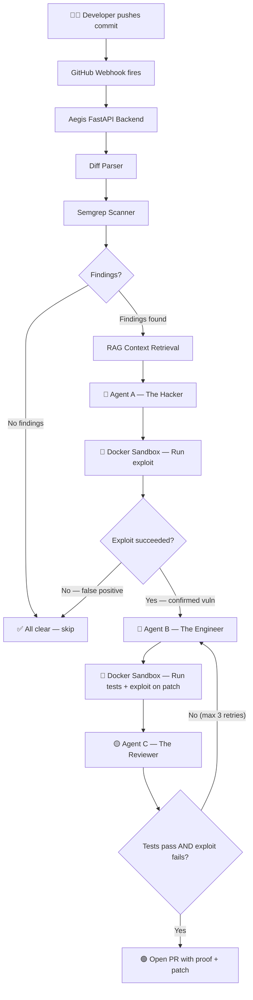

# 🛡️ Aegis — Implementation Plan & Architecture

## What We're Building

Aegis is an **autonomous white-hat vulnerability remediation system** — a multi-agent pipeline that:

1. **Listens** for code pushes via GitHub webhooks
2. **Scans** changed files with Semgrep (cheap first-pass filter)
3. **Enriches** context via RAG (retrieves related files from a codebase index)
4. **Hacks** — Agent A (The Hacker) writes a proof-of-concept exploit using Claude
5. **Validates** — Runs the exploit in an isolated Docker sandbox to confirm it's real
6. **Patches** — Agent B (The Engineer) writes a minimal fix
7. **Reviews** — Agent C (The Reviewer) verifies tests pass and exploit is now blocked
8. **Ships** — Opens a GitHub PR with exploit proof, patch, and test results

> [!IMPORTANT]
> The key insight: **No tool today closes the loop from detected → proved → patched → verified → merged.** Aegis does this fully autonomously.

---

## Architecture Overview



---

## Improvements Over Phases.md

| Area | Original | Improved |
|------|----------|----------|
| **Configuration** | Hardcoded values scattered | Centralized `config.py` with dataclass |
| **Logging** | `print()` statements | Proper `logging` module with colored output |
| **Error Handling** | Basic try/except | Structured error classes + graceful degradation |
| **Type Safety** | Loose dicts | Pydantic models for all data flowing between phases |
| **Test Repo** | Created manually via bash | Created programmatically in `test_repo/` |
| **Project Structure** | Flat files | Proper Python package with `__init__.py` exports |
| **Requirements** | Inline pip installs | `requirements.txt` with pinned versions |
| **.gitignore** | Missing | Comprehensive .gitignore |

---

## Final Project Structure

```
Aegis/
├── docs/                         # Existing documentation
│   ├── about.md
│   ├── Phases.md
│   └── context.md
├── main.py                       # FastAPI entry point
├── orchestrator.py               # Pipeline coordinator
├── config.py                     # Centralized configuration
├── agents/
│   ├── __init__.py
│   ├── hacker.py                 # Agent A — exploit writer
│   ├── engineer.py               # Agent B — patch writer
│   └── reviewer.py               # Agent C — verifier + retry loop
├── rag/
│   ├── __init__.py
│   ├── indexer.py                # One-time repo indexing
│   └── retriever.py              # Per-commit context retrieval
├── sandbox/
│   ├── __init__.py
│   └── docker_runner.py          # Isolated Docker execution
├── github/
│   ├── __init__.py
│   ├── webhook.py                # Webhook validation + parsing
│   ├── diff_fetcher.py           # Git diff retrieval
│   └── pr_creator.py             # PR creation
├── scanner/
│   ├── __init__.py
│   └── semgrep_runner.py         # Semgrep integration
├── test_repo/                    # Intentionally vulnerable demo repo
│   ├── app.py
│   └── test_app.py
├── tests/                        # Phase verification tests
│   ├── test_phase2.py
│   ├── test_phase3.py
│   ├── test_phase4.py
│   ├── test_phase5.py
│   └── test_phase6.py
├── requirements.txt
├── .env.example                  # Template for secrets
├── .gitignore
└── README.md
```

---

## Phase Execution Plan

### Phase 0 — Foundation Setup
- Create all directories and files
- Write `requirements.txt`, `.env.example`, `.gitignore`, `config.py`
- Create `test_repo/` with intentionally vulnerable code
- **Verify:** `python -c "import fastapi, chromadb, anthropic; print('OK')"`

### Phase 1 — GitHub Webhooks
- Implement `github/webhook.py` (signature verification + payload parsing)
- Implement `main.py` (FastAPI server with `/health` and `/webhook/github`)
- **Verify:** `curl http://localhost:8000/health`

### Phase 2 — Diff & Scanner
- Implement `github/diff_fetcher.py` (clone/pull + GitHub API diff)
- Implement `scanner/semgrep_runner.py` (run Semgrep, format findings)
- **Verify:** `python tests/test_phase2.py`

### Phase 3 — RAG Memory
- Implement `rag/indexer.py` (parse files, extract metadata, store in ChromaDB)
- Implement `rag/retriever.py` (semantic search for related context)
- **Verify:** `python tests/test_phase3.py`

### Phase 4 — Agent A (Hacker)
- Implement `agents/hacker.py` (Claude extended thinking → exploit script)
- **Verify:** `python tests/test_phase4.py`

### Phase 5 — Docker Sandbox
- Implement `sandbox/docker_runner.py` (isolated container execution)
- **Verify:** `python tests/test_phase5.py`

### Phase 6 — Agent B (Engineer)
- Implement `agents/engineer.py` (Claude → minimal security patch)
- **Verify:** `python tests/test_phase6.py`

### Phase 7 — Agent C (Reviewer) + Retry Loop
- Implement `agents/reviewer.py` (verify patch + full remediation loop)

### Phase 8 — PR Creator
- Implement `github/pr_creator.py` (branch, commit patch, open PR with proof)

### Phase 9 — Orchestrator + Integration
- Implement `orchestrator.py` (wire all phases together)
- Update `main.py` to trigger pipeline on webhook
- **Verify:** Full end-to-end test

---

## Verification Plan

### Per-Phase Tests
Each phase has a dedicated test script that validates the component in isolation.

### End-to-End Test (Phase 9)
Push vulnerable code to the test repo → watch the full pipeline execute → verify PR is created with exploit proof and working patch.
