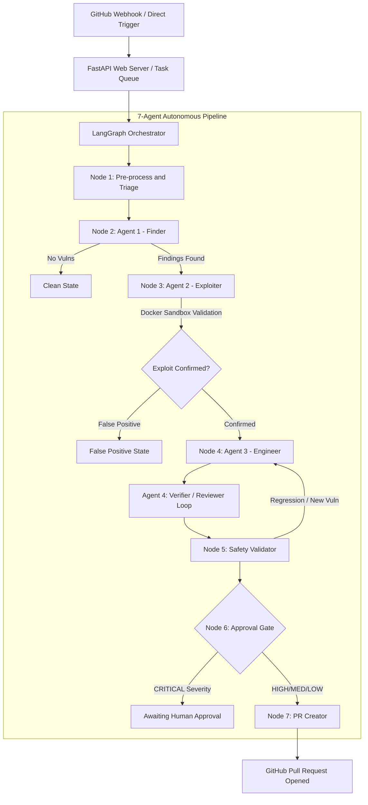

# Aegis — Product Requirements Document

**Status:** Draft v0.1 — assembled from existing architecture spec
**Owner:** Mitul Bhatia
**Last updated:** 2026-08-07

---

## 1. Product Summary

Aegis is an autonomous, multi-agent security remediation platform. It watches
incoming code changes (git diffs / PRs), identifies vulnerabilities, proves
they are real by generating and running proof-of-concept exploits inside an
isolated sandbox, synthesizes a verified patch, re-validates it for safety,
and opens a GitHub Pull Request — with a human approval gate for CRITICAL
findings.

The core differentiator versus a plain static-analysis bot: findings are not
reported until they are **confirmed exploitable**, which should cut false
positives dramatically compared to SAST-only tools.

---

## 2. Problem Statement

Traditional SAST tools flood engineering teams with unverified findings,
most of which are false positives or low-impact. Teams either ignore the
noise or spend disproportionate time triaging it. Aegis's thesis: don't
report a vulnerability until you've proven it's exploitable, and don't stop
at reporting — ship a verified fix.

---

## 3. Goals

- Detect security-relevant changes in a commit/PR automatically.
- Confirm vulnerabilities via sandboxed PoC execution, not just static rules.
- Generate a minimal, correct patch plus a regression test for it.
- Prevent the patch itself from introducing a new vulnerability or breaking
  existing behavior (Safety Validator).
- Auto-open a PR for non-critical findings; require human approval for
  CRITICAL severity before anything ships.
- Keep exploit execution fully contained — no network egress, no write
  access to the real codebase, hard resource/time limits.

## 3.1 Non-Goals (for this version)

- Aegis does not scan or exploit systems/repos it does not own or have
  explicit authorization to test.
- Aegis does not run PoC exploits outside the Docker sandbox, ever.
- Aegis is not a general pentesting tool for third-party targets — it is
  scoped to first-party CI/CD commits.

---

## 4. System Architecture

**Orchestration:** LangGraph state machine, single `AegisPipelineState`
(TypedDict) threaded through every node — see §5.

**Entry point:** FastAPI service receiving GitHub webhooks or direct
triggers, handing off to a task queue / worker for the actual pipeline run
(this is the `worker.py` / `graph.py` split already in the repo).

---

## 5. State Schema

`AegisPipelineState` (TypedDict, `total=False`) carries:

| Group | Fields |
|---|---|
| Mission metadata | `scan_id`, `repo_full_name`, `commit_sha`, `branch`, `push_info` |
| Pre-processing / RAG | `local_repo_path`, `diff`, `semgrep_findings`, `rag_context`, `dependency_vulns` |
| Findings & proofs | `vulnerability_findings`, `confirmed_vulnerabilities`, `exploit_artifacts` |
| Loop trackers | `current_vuln_index`, `patched_code`, `test_code`, `original_code`, `verification_passed`, `retry_count`, `rescan_count`, `rescan_needed`, `safety_report`, `awaiting_approval` |
| Output | `pr_urls`, `patch_artifacts`, `pipeline_status`, `error` |

---

## 6. Agent Specifications

| Agent | Role | Model | Output Contract |
|---|---|---|---|
| Agent 0 — Triage | Classify whether a commit needs a full scan | Groq `llama-3.3-70b-versatile` | `TriageResult` (domains, priority, brief, skip_scan) |
| Agent 1 — Finder | Identify all vulnerabilities in the diff | Groq `llama-3.3-70b-versatile` (fallback Mistral `mistral-large-latest`) | `List[VulnerabilityFinding]` |
| Agent 2 — Exploiter | Confirm exploitability inside the Docker sandbox | Groq `llama-3.3-70b-versatile` (fallback Mistral `mistral-large-latest`) | exploit script + verdict, run in `aegis-sandbox:latest` |
| Agent 3 — Engineer | Write the patch + regression test | Mistral `codestral-latest` / `mistral-large-latest` | `EngineerOutput` (patched_code, test_code) |
| Agent 4 — Reviewer/Verifier | Diagnose failed patches, feed back to Engineer | Groq `llama-3.3-70b-versatile` | `ReviewerDiagnosis` |

Full system prompts for each agent are in the accompanying `prompts/`
bundle — one file per agent, unchanged from the working spec so they can be
dropped straight into `agents/*.py`.

---

## 7. Operational & Security Policies

1. **Sandbox isolation** — PoC exploits and generated pytest files run only
   inside `aegis-sandbox:latest`: target code mounted read-only (`/app:ro`),
   512MB memory cap, 1.0 CPU limit, 30s timeout, no network egress.
2. **Fork PR policy** — PRs from external forks are rejected before trigger
   execution (prevents sandbox escape / arbitrary code execution on host
   infra via a malicious fork).
3. **Session management** — `aegis_session` cookie, `SameSite=None` +
   `Secure=True` on HTTPS, backed by `Authorization: Bearer <user_id>` and
   `X-Aegis-User-Id` headers for reliability across 3rd-party-cookie-blocking
   environments.
4. **Deterministic CVSS** — scores computed by a strict CVSS v3.1 vector
   calculator (`utils/cvss.py`), not left to model output.

---

## 8. Current Status

- Pipeline architecture, state schema, and all agent prompts: **fully
  specified**.
- `worker.py`, `graph.py`: in progress.
- Deployment: earliest demo version is the only one currently live. Every
  subsequent version has failed to deploy on **both Render and Vercel**.

---

## 9. Open Items / Blockers

- **Deployment failures (top priority):** need actual build/runtime logs
  from Render and Vercel to diagnose. Likely candidate: Vercel's serverless
  execution model cannot host the Docker sandbox or a long-running
  LangGraph worker — Render (or a dedicated VM/container host) is the
  correct target for the worker + sandbox; Vercel may only be appropriate
  for a thin frontend/API-trigger layer, if used at all.
- **Feedback loop design:** "RLHF loop" needs to be scoped — true weight
  fine-tuning isn't available against hosted Groq/Mistral models. The
  practical version is a persistent eval log (finding → patch →
  verification outcome) that feeds prompt iteration and few-shot examples.
  Needs a decision on storage (Postgres table vs. flat log) before
  implementation.
- **Human approval UX:** `awaiting_approval` state exists in the graph but
  the actual approval surface (Slack message? dashboard? GitHub comment
  command?) isn't specified yet.
- **Rescan loop bound:** `rescan_count` / `retry_count` exist in state but
  max-retry / circuit-breaker values aren't documented — needed to prevent
  infinite Engineer↔Reviewer loops on unfixable findings.