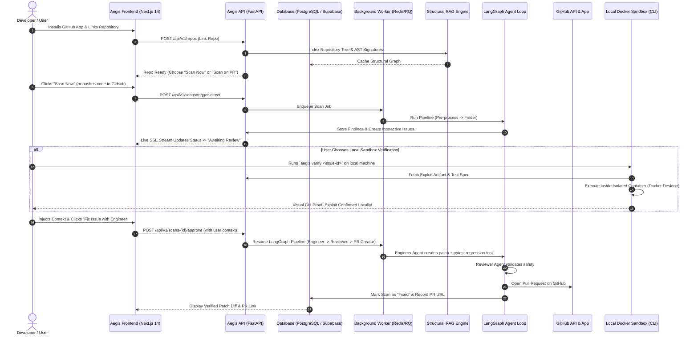

# Aegis 2.0 — Autonomous Security Remediation Platform
## Product Requirements Document (PRD)

**Status:** Approved Architecture v2.0  
**Owner:** Mitul Bhatia  
**System Architecture:** Hybrid Cloud Orchestrator + Local Sandbox Verification + GitHub App CI/CD  

---

## 1. Executive Summary & Vision

**Aegis** is an autonomous AI security remediation platform designed to eliminate false positives and directly resolve vulnerabilities. Unlike traditional SAST bots that merely dump noisy alerts on developers, Aegis:
1. **Maps repository structure & architecture** using a lightweight AST-aware structural RAG engine.
2. **Identifies high-confidence vulnerabilities & architectural flaws** via an autonomous **Finder Agent** combining Semgrep SAST and LLM reasoning.
3. **Raises findings as Interactive Issues** in the Aegis Web Dashboard.
4. **Enables Developer Control & Verification**:
   - **Option A (DevOps Flex / Real Verification):** Developer can run a 1-command **Aegis Local Sandbox Runner** (`aegis verify <issue-id>`) powered by Docker Desktop to safely reproduce and verify exploitability with zero-trust container isolation (`cap_drop: ALL`, `network: none`, non-root execution).
   - **Option B (Autonomous Fix):** Developer triggers the **Engineer Agent** with optional custom context injection to synthesize an exact, regression-tested patch.
5. **Validates the patch** with a **Reviewer Agent** to ensure zero regressions or new attack surfaces.
6. **Opens a verified GitHub Pull Request** via the **PR Creator Agent** with clear proof, patch diff, and instructions.

---

## 2. Core Architecture & Workflow

---

## 3. Discrete Implementation Tasks (Ralph Loop)

Each task below is a discrete, fully testable unit of work.

---

### ## Task 1: Clean Foundation & Database Architecture
- Set up `backend/` directory structure.
- Define `backend/app/config.py` with strict Pydantic Settings (`DATABASE_URL`, `REDIS_URL`, `GROQ_API_KEY`, `GITHUB_APP_*`, etc.).
- Set up SQLAlchemy 2.0 ORM with PostgreSQL + SQLite fallback in `backend/app/core/database.py`.
- Define models in `backend/app/models/`:
  - `User`: GitHub user profile, installation ID.
  - `Repository`: GitHub repo metadata, index status, settings.
  - `Scan`: Scan status, commit, branch, vulnerability type, severity, patch diff, PR URL, logs.
  - `Issue`: Interactive findings raised for user review, reproduction script, user context notes.
- Provide database initialization and migration scripts.

---

### ## Task 2: GitHub App Authentication & Installation Sync
- Implement `backend/app/github/auth.py`:
  - Signed JWT generation using App ID and private key.
  - Token caching for short-lived installation access tokens.
- Implement `backend/app/github/client.py`:
  - Fetch accessible repositories for an installation.
  - Fetch commit details and PR diffs.
  - Create branches, commit files, and open pull requests.
- Implement `backend/app/api/auth.py` and `backend/app/api/repos.py` for OAuth, installation linking, and available repos listing matching frontend contracts.

---

### ## Task 3: Structural Codebase RAG & Tree Indexer
- Implement `backend/app/rag/tree_indexer.py`:
  - Shallow clone / repository tree parser that skips vendor/node_modules/binaries.
  - AST-aware symbol and function signature extractor (Python, JavaScript/TypeScript, Go, Rust).
  - Lightweight vector/semantic representation for fast targeted retrieval.
- Implement `backend/app/rag/context_builder.py`:
  - Given a vulnerable file or function, retrieve parent class, callers, imports, and related sanitization functions without blowing up token context.

---

### ## Task 4: Finder Agent (Semgrep SAST + AST Structural Analysis)
- Implement `backend/app/scanner/semgrep.py`:
  - Execute Semgrep rulesets (security-audit, owasp-top-10) with JSON output parsing and timeout guards.
- Implement `backend/app/agents/finder.py`:
  - Analyze Semgrep findings combined with RAG structural context using Groq LLM.
  - Deduplicate, filter noise, assign strict CVSS v3.1 vector + severity (CRITICAL, HIGH, MEDIUM, LOW).
  - Produce structured `List[VulnerabilityFinding]` with exact line numbers, vulnerable snippets, and attack vector explanation.

---

### ## Task 5: Issue Hub, REST Endpoints, SSE Live Feed & Context Injection
- Implement `backend/app/api/scans.py`:
  - Trigger scan endpoint (`/trigger-direct`, `/trigger`).
  - Scan history, detail, SARIF export (`/scans/{id}/sarif`).
  - Human-in-the-loop actions: Approve (`/scans/{id}/approve`) with optional user context, Reject (`/scans/{id}/reject`).
  - Real-time Server-Sent Events (SSE) live feed (`/scans/live`) broadcasting state transitions.
- Implement `backend/app/api/stats.py` and `backend/app/api/intelligence.py` for dashboard metrics and scorecard grades matching the frontend API client.

---

### ## Task 6: DevOps Local Sandbox & CLI Verification Runner
- Implement `backend/runner/Dockerfile.sandbox`:
  - Hardened, non-root user execution container (`nobody:nogroup` / `sandboxuser`).
  - Strict resource constraints (512MB RAM, 1 CPU, 30s timeout, read-only volume mounts).
- Implement `backend/runner/aegis_cli.py`:
  - Developer CLI command: `python runner/aegis_cli.py verify <scan_id_or_file>` that launches a real Docker container via Docker Desktop.
  - Safely tests exploitability in a hermetic container and outputs visual terminal proof.
  - Sends verification result back to the Aegis backend API.

---

### ## Task 7: Engineer, Reviewer & PR Creator Agents
- Implement `backend/app/agents/engineer.py`:
  - Accepts vulnerability finding + RAG context + user injected notes.
  - Generates minimal surgical patch code + pytest regression test case.
- Implement `backend/app/agents/reviewer.py`:
  - Reviews proposed patch for safety, syntax correctness, and absence of new regressions.
- Implement `backend/app/agents/pr_creator.py`:
  - Formats human-readable PR body (Problem, Proof of Concept, Fix Details, Verification Logs).
  - Uses GitHub Client to create fix branch, commit patch, and open Pull Request.

---

### ## Task 8: LangGraph Multi-Agent Pipeline & Background Worker Queue
- Implement `backend/app/pipeline/state.py`:
  - Pydantic / TypedDict `AegisState` tracking all stages, findings, user context, and patch status.
- Implement `backend/app/pipeline/orchestrator.py`:
  - LangGraph StateGraph connecting `pre_process` -> `finder` -> `issue_created` (pause/wait for approval or local verify) -> `engineer` -> `reviewer` -> `pr_creator`.
- Implement `backend/app/core/queue.py` & `backend/app/pipeline/worker.py`:
  - Lightweight background task runner (Redis Queue with graceful thread fallback).

---

### ## Task 9: Frontend Contract Alignment, End-to-End Testing & Verification
- Verify all Next.js `aegis-frontend` routes against the new FastAPI backend:
  - Auth flow (`/auth/callback`, `/auth/me`).
  - Dashboard repository listing, add repo, scan history.
  - Scan detail page (`/scans/[id]`): live timeline, code diff viewer, findings JSON, approve/fix action.
  - Live SSE feed updates in real-time.
- Run complete end-to-end integration test against a test repository.

---

### ## Task 10: Dockerization, Deployment Config & Production Documentation
- Create `backend/Dockerfile` for high-performance production deployment.
- Create `docker-compose.yml` for local 1-command startup (`docker compose up`).
- Update `README.md` and `docs/` with architecture diagrams, setup guides, and CLI usage.