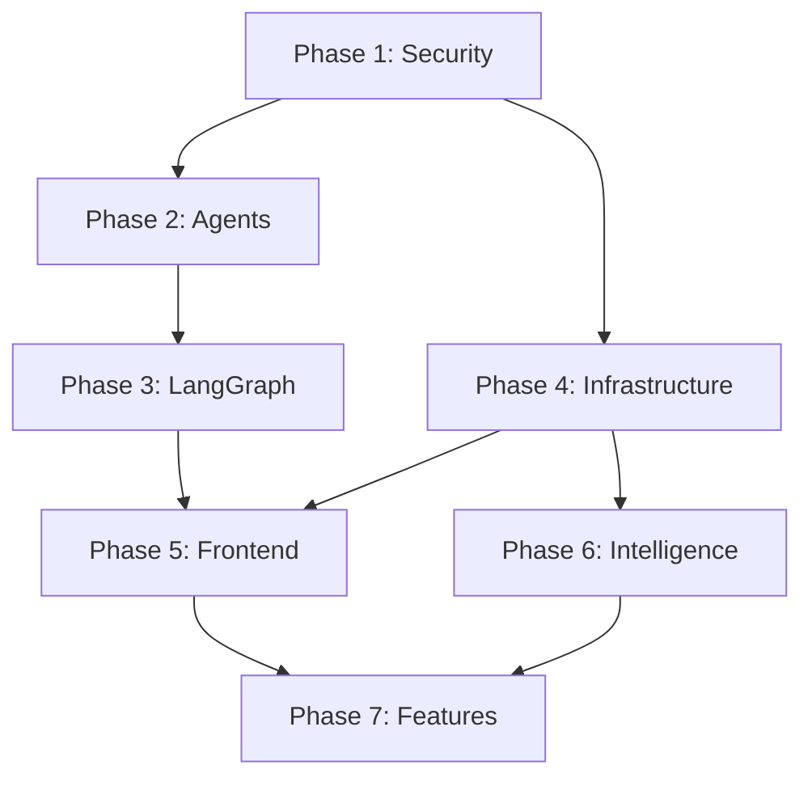

# Aegis v2 — Phased Execution Roadmap

> **Based on: [Update.md](../Update.md) deep analysis + independent codebase audit**
>
> Each phase has its own detailed task file. Complete phases in order — later phases depend on earlier ones.

---

## Architecture Target

```
  GitHub Webhook ──→ FastAPI Gateway ──→ LangGraph Supervisor
                                              │
                    ┌─────────────────────────┼─────────────────────────┐
                    │ (parallel)              │                   (parallel)
                    ▼                         ▼                         ▼
              Agent D                   Agent A                   Agent E
            Taint Analyst             The Hacker                CVE Scout
            (Haiku 4.5)             (Opus 4.7 +                (Haiku 4.5)
            CodeQL/AST               extended think)            NVD/OSV
                    │                         │                         │
                    └────────────┬────────────┘                         │
                                 │  Merged context                      │
                                 ▼                                      ▼
                       Exploit Gen +                         Dep CVE Report
                       Confidence ≥0.7?                      EPSS Score High?
                            YES │                          (parallel PR comment)
                                ▼
                          Agent B
                        The Engineer
                        (Sonnet 4.6
                         + SKILL.md)  ◄────────────────────┐
                                │ patch_diff                │
                                ▼                           │
                          Agent C                  REGRESSION/
                        The Reviewer               INCOMPLETE
                        (GPT-4.1                   (with locked lines
                         SandboxAgent)              + problem areas)
                                │ APPROVED
                                ▼
                        Auto-merge PR
                        + Memory Consolidation
                        (Haiku 4.5)
```

---

## Phase Overview

| Phase | Name | Focus | Est. Effort |
|-------|------|-------|-------------|
| **1** | [Security & Reliability](./PHASE_1_SECURITY.md) | Fix critical bugs, harden sandbox, encrypt tokens | 2-3 days |
| **2** | [Agent Architecture](./PHASE_2_AGENTS.md) | Verifier → real LLM agent, multi-vuln pipeline, structured output | 3-4 days |
| **3** | [LangGraph Migration](./PHASE_3_LANGGRAPH.md) | Replace orchestrator with LangGraph, add Triage agent, CVSS scoring | 4-5 days |
| **4** | [Backend Infrastructure](./PHASE_4_INFRASTRUCTURE.md) | Event-driven SSE, API versioning, pagination, Alembic, health checks | 3-4 days |
| **5** | [Frontend Overhaul](./PHASE_5_FRONTEND.md) | Pipeline visualization, error boundaries, diff viewer, HITL approval | 4-5 days |
| **6** | [Intelligence & RAG](./PHASE_6_INTELLIGENCE.md) | Code embeddings, vuln pattern library, real threat engine, SARIF export | 3-4 days |
| **7** | [Feature Expansion](./PHASE_7_FEATURES.md) | PR review mode, dependency scanning, regression detection, notifications | Ongoing |

---

## Dependency Graph



**Rules:**
- Phase 1 MUST complete before anything else (security fixes are non-negotiable)
- Phases 2 and 4 can run in parallel after Phase 1
- Phase 3 depends on Phase 2 (agents must be refactored before orchestration layer)
- Phase 5 depends on Phases 3+4 (frontend needs the new API contracts)
- Phase 7 is ongoing feature work after the foundation is solid

---

## What We Will NOT Use (Unless Required)

- **No MCP servers** — direct SDK calls to LLM providers (Groq, Anthropic, OpenAI, Mistral)
- **No LangChain** — we use LangGraph directly for orchestration, raw SDKs for agents
- **No external databases** initially — keep SQLite + Alembic until PostgreSQL is actually needed
- **No Redis** initially — use asyncio Queue for SSE events; add Redis only when scaling to multiple backend instances

---

## Files in This Directory

```
phases/
├── PHASE_0_OVERVIEW.md          ← You are here
├── PHASE_1_SECURITY.md          ← Critical security fixes
├── PHASE_2_AGENTS.md            ← Agent architecture redesign
├── PHASE_3_LANGGRAPH.md         ← Orchestration migration
├── PHASE_4_INFRASTRUCTURE.md    ← Backend hardening
├── PHASE_5_FRONTEND.md          ← UI/UX overhaul
├── PHASE_6_INTELLIGENCE.md      ← RAG, threat engine, exports
└── PHASE_7_FEATURES.md          ← New capabilities
```
